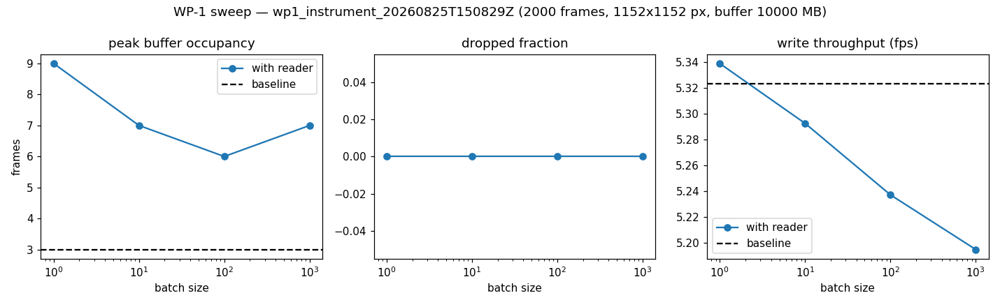
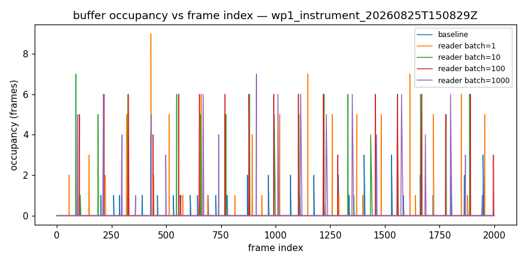
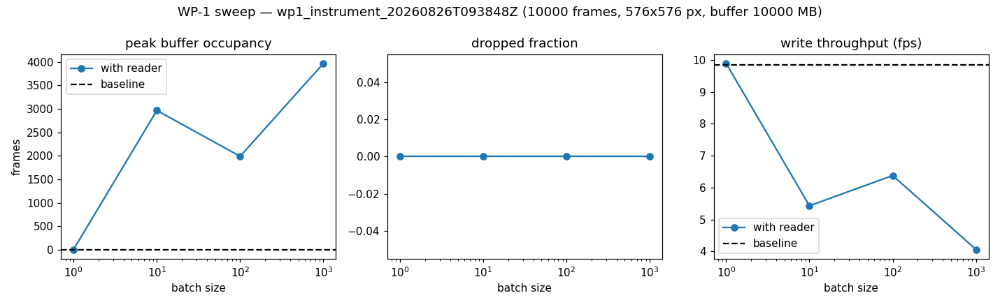
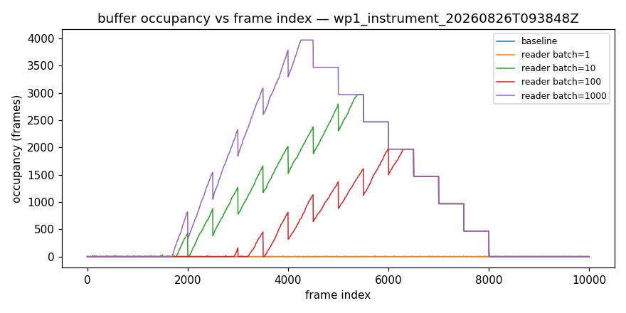

# WP-1 live-reader performance — go/no-go report

**Overall verdict: NO-GO**

Do NOT adopt live streaming as-is: the concurrent reader compromised acquisition. Fall back to post-FOV batch processing (or the watchdog, option c) and investigate the contention.

## Verdict by mode

| mode | verdict |
|---|---|
| instrument | NO-GO |

## Thresholds

| threshold | value |
|---|---|
| max dropped fraction | 0.001 |
| min throughput retention | 0.95 |
| max peak occupancy fraction | 0.5 |

## wp1_instrument_20260825T150829Z — GO (instrument)

_2000 frames, 1152x1152 px, buffer 10000 MB_

Baseline (no reader): throughput 5.323 fps, peak occupancy 3.0, dropped fraction 0.

| batch | peak occ | occ frac | dropped frac | throughput fps | retention | pass |
|---|---|---|---|---|---|---|
| 1 | 9.0 | 0.0023 | 0 | 5.339 | 1.003 | yes |
| 10 | 7.0 | 0.0018 | 0 | 5.293 | 0.9943 | yes |
| 100 | 6.0 | 0.0015 | 0 | 5.237 | 0.9839 | yes |
| 1000 | 7.0 | 0.0018 | 0 | 5.195 | 0.976 | yes |

## wp1_instrument_20260826T093848Z — NO-GO (instrument)

_10000 frames, 576x576 px, buffer 10000 MB_

Baseline (no reader): throughput 9.835 fps, peak occupancy 7.0, dropped fraction 0.

| batch | peak occ | occ frac | dropped frac | throughput fps | retention | pass |
|---|---|---|---|---|---|---|
| 1 | 7.0 | 0.0004 | 0 | 9.889 | 1.006 | yes |
| 10 | 2968.0 | 0.1878 | 0 | 5.431 | 0.5523 | NO |
| 100 | 1990.0 | 0.1259 | 0 | 6.379 | 0.6486 | NO |
| 1000 | 3968.0 | 0.2511 | 0 | 4.064 | 0.4132 | NO |

## Plots

## Provenance

- `wp1_instrument_20260825T150829Z`: mode `instrument` on `wsju06` (Windows-10-10.0.19045-SP0), pycroflow 0.0.1, git 75ce0911d2a3, 2026-08-25T14:32:46.670553+00:00 → 2026-08-25T15:08:29.120069+00:00
- `wp1_instrument_20260826T093848Z`: mode `instrument` on `wsju06` (Windows-10-10.0.19045-SP0), pycroflow 0.0.1, git 75ce0911d2a3, 2026-08-26T07:23:04.223244+00:00 → 2026-08-26T09:38:48.707134+00:00
