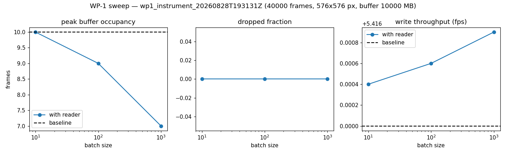
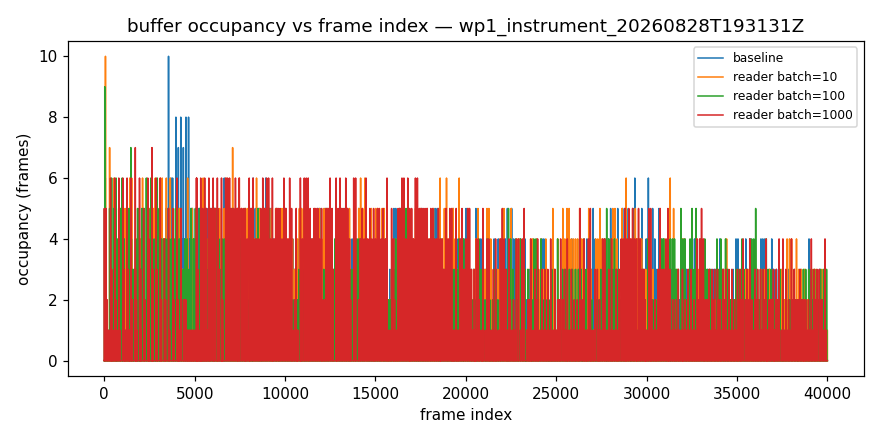
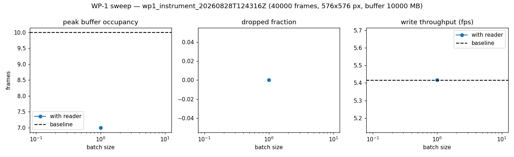
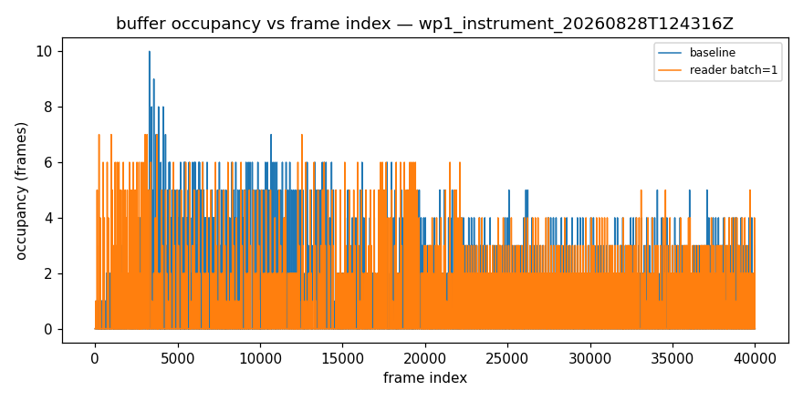

# WP-1 live-reader performance — go/no-go report

**Overall verdict: GO**

Adopt live incremental NDTiff reading (option b) as the primary path: the concurrent reader did not compromise acquisition.

## Verdict by mode

| mode | verdict |
|---|---|
| instrument | GO |

## Thresholds

| threshold | value |
|---|---|
| max dropped fraction | 0.001 |
| min throughput retention | 0.95 |
| max peak occupancy fraction | 0.5 |

## wp1_instrument_20260828T193131Z — GO (instrument)

_40000 frames, 576x576 px, buffer 10000 MB_

Baseline (no reader): throughput 5.416 fps, peak occupancy 10.0, dropped fraction 0.

| batch | peak occ | occ frac | dropped frac | throughput fps | retention | pass |
|---|---|---|---|---|---|---|
| 10 | 10.0 | 0.0025 | 0 | 5.416 | 1 | yes |
| 100 | 9.0 | 0.0023 | 0 | 5.417 | 1 | yes |
| 1000 | 7.0 | 0.0018 | 0 | 5.417 | 1 | yes |

## wp1_instrument_20260828T124316Z — GO (instrument)

_40000 frames, 576x576 px, buffer 10000 MB_

Baseline (no reader): throughput 5.416 fps, peak occupancy 10.0, dropped fraction 0.

| batch | peak occ | occ frac | dropped frac | throughput fps | retention | pass |
|---|---|---|---|---|---|---|
| 1 | 7.0 | 0.0018 | 0 | 5.417 | 1 | yes |

## Plots

## Provenance

- `wp1_instrument_20260828T193131Z`: mode `instrument` on `wsju06` (Windows-10-10.0.19045-SP0), pycroflow 0.0.1, git 6eb2a43f04e4, 2026-08-28T19:31:31.036674+00:00 → 2026-08-29T03:44:05.082249+00:00
- `wp1_instrument_20260828T124316Z`: mode `instrument` on `wsju06` (Windows-10-10.0.19045-SP0), pycroflow 0.0.1, git 6eb2a43f04e4, 2026-08-28T12:43:16.787421+00:00 → 2026-08-28T16:49:38.886111+00:00
