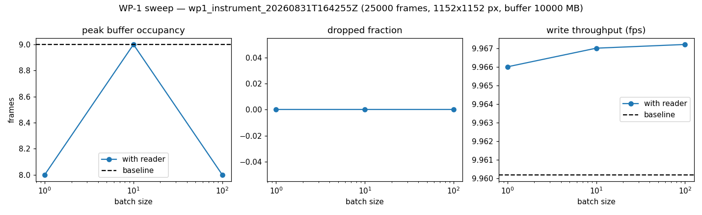
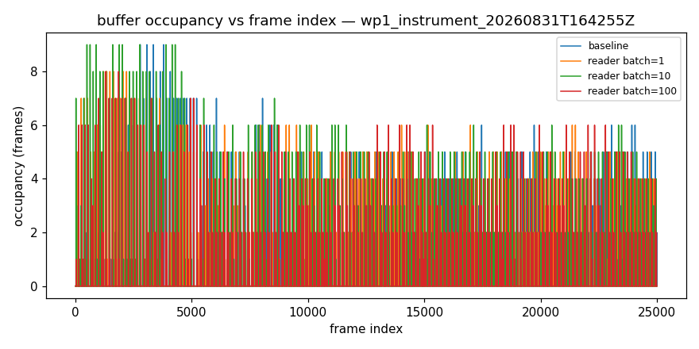
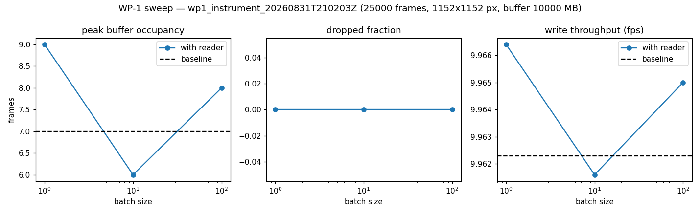
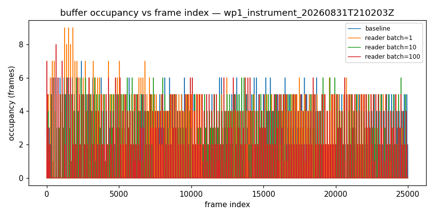

# WP-1 live-reader performance — go/no-go report

**Overall verdict: GO**

Adopt live incremental NDTiff reading (option b) as the primary path: the concurrent reader did not compromise acquisition.

## Verdict by mode

| mode | verdict |
|---|---|
| instrument | GO |

## Thresholds

| threshold | value |
|---|---|
| max dropped fraction | 0.001 |
| min throughput retention | 0.95 |
| max peak occupancy fraction | 0.5 |

## wp1_instrument_20260831T164255Z — GO (instrument)

_25000 frames, 1152x1152 px, buffer 10000 MB_

Baseline (no reader): throughput 9.96 fps, peak occupancy 9.0, dropped fraction 0.

| batch | peak occ | occ frac | dropped frac | throughput fps | retention | pass |
|---|---|---|---|---|---|---|
| 1 | 8.0 | 0.002 | 0 | 9.966 | 1.001 | yes |
| 10 | 9.0 | 0.0023 | 0 | 9.967 | 1.001 | yes |
| 100 | 8.0 | 0.002 | 0 | 9.967 | 1.001 | yes |

## wp1_instrument_20260831T210203Z — GO (instrument)

_25000 frames, 1152x1152 px, buffer 10000 MB_

Baseline (no reader): throughput 9.962 fps, peak occupancy 7.0, dropped fraction 0.

| batch | peak occ | occ frac | dropped frac | throughput fps | retention | pass |
|---|---|---|---|---|---|---|
| 1 | 9.0 | 0.0023 | 0 | 9.966 | 1 | yes |
| 10 | 6.0 | 0.0015 | 0 | 9.962 | 0.9999 | yes |
| 100 | 8.0 | 0.002 | 0 | 9.965 | 1 | yes |

## Plots

## Provenance

- `wp1_instrument_20260831T164255Z`: mode `instrument` on `wsju06` (Windows-10-10.0.19045-SP0), pycroflow 0.0.1, git c9eb4c8ad64c, 2026-08-31T16:42:55.996781+00:00 → 2026-08-31T19:30:57.818113+00:00
- `wp1_instrument_20260831T210203Z`: mode `instrument` on `wsju06` (Windows-10-10.0.19045-SP0), pycroflow 0.0.1, git c9eb4c8ad64c, 2026-08-31T21:02:03.105675+00:00 → 2026-08-31T23:52:33.047068+00:00
